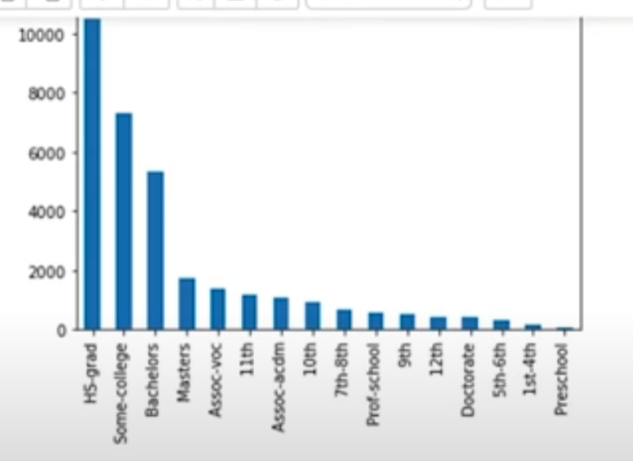
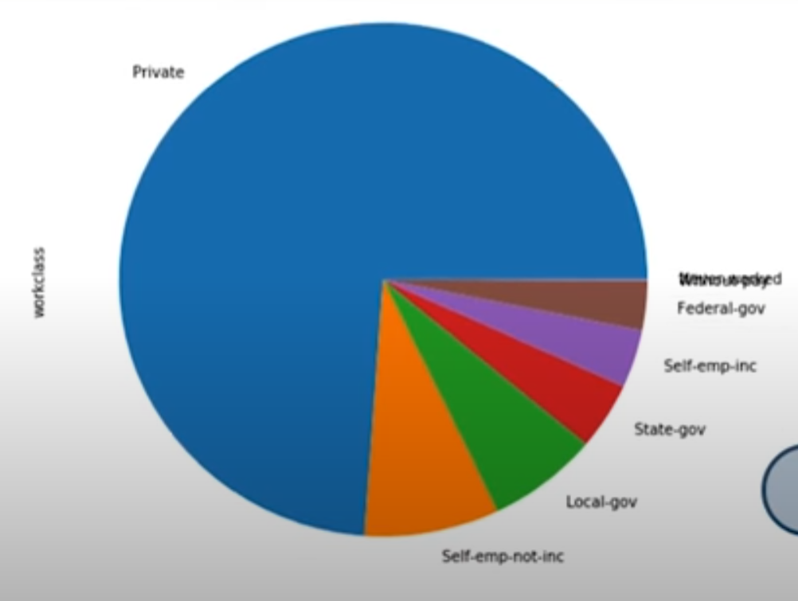
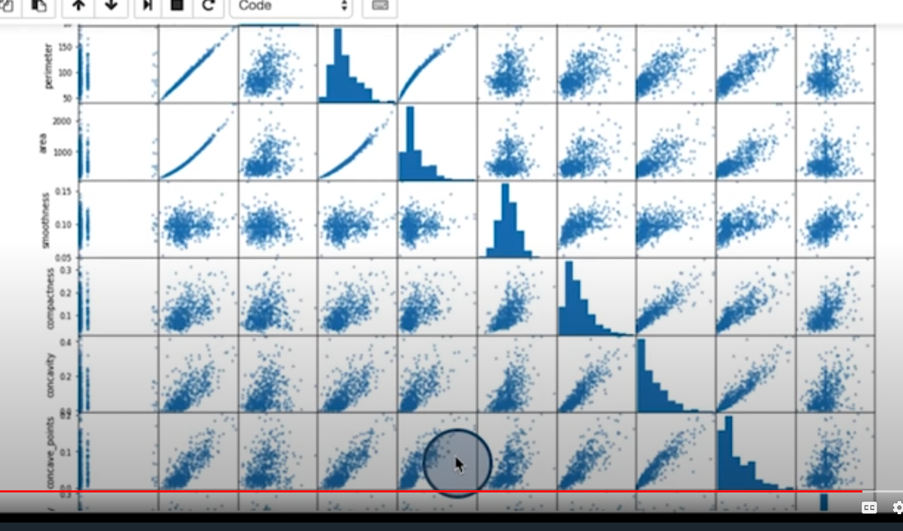
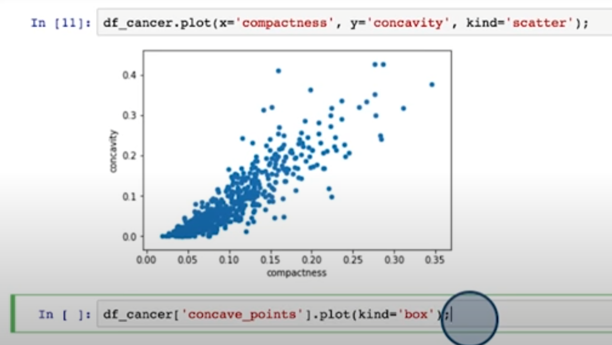
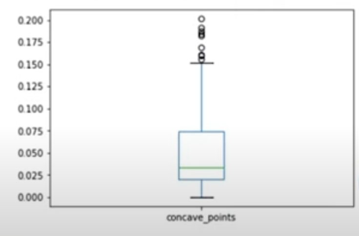

# 16. Cleaning Data
* Common Problems
 - Incorrect Data Types
 - Missing Data
 - Duplicates
 - Structural Problems
   - Different columns in CSV file for the same data
 - Mismatch of number of records (plotting)
 
 
 # 20. Plotting with pandas
 * histogram
 * Could be called directly on the pandas dataframe
 * semicolon (;) to suppress unwanted output

 ```python 
df_census.hist(figsize=8,8)
``` 

* Call one histogram for a specific series by doing the below

```python
df_census['age'].hist();
# Or could use plot kind hist
df_census['age'].plot(kind='hist');

```

* you could call bar plot function on Value_counts()

```python
df_census['education'].value_counts().plot(kind='bar')
```




* you could also create a pie chart /w Value_counts()

```python
df_census['education'].value_counts().plot(kind='pie', figsize=(8,8))
```





##  This function shows relationships among numerical variables with scatterplots 
- This also shows a histogram for each varable
* 
```python
pd.plotting.scatter_matrix(df_cancer, figsize=(15,15))
```




## Show a single scatterplot below using standard plot function
- specify x and y axis as columns

df_cancer.plot(x='compactness', y='concavity', kind='scatter');




## Box plot example
```python
df_cancer['concave_points'].plot(kind='box');
```



# Pandas Visualization Document
<https://pandas.pydata.org/pandas-docs/stable/user_guide/visualization.html>