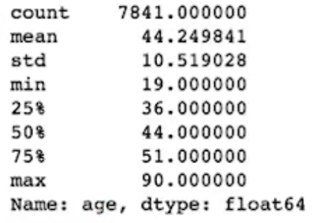

# Lesson 3
## 23. Drawing Conclusions Example

- Use masks to to separate diagnosis types (M vs B) and store them in seperate sub-dataframes
- Use .describe() to generate metrics on each column

-h stograms below compare the area for both benign and malignant tumors


# 25. Communicating Results
- Visuals can be used efficiently draw conclusions from your analysis
- Note the follow chart attributes below
 * Labeling
 * Size
 * Color
 * Data Selection 
 Historams, barchats, pie charts in the next slides
 
# 26. Communicate Results Example
```python
import pandas as pd
% matplotlib inline

df_census = pd.read_csv('census_income_data.csv')
df_a = df_census[df_census['income'] == ' >50K']
df_b = df_census[df_census['income'] == ' <=50K']

df_a['education'].value_counts().plot(kind='bar');
```


#### Notice that the default order of the x-axis is based on the value_counts order (max count descending), instead of the default column order, so we should configure  the index order 

- The code below performs the modifications so that it is indexed in the same order

```python
ind = df_a['education'].value_counts().index
df_a['education'].value_counts()[ind].plot(kind='bar');
df_b['education'].value_counts()[ind].plot(kind='bar');
```


### Let's use the same indexing technique across the other column comparisons

```python
ind = df_a['workclass'].value_counts().index
df_a['workclass'].value_counts()[ind].plot(kind='pie', figsize=(8,8));
```


### Lastly, use histogram to plot distribution of each age group

```python
df_a['age'].hist()

```


```python
df_b['age'].hist()
```


```python
df_a['age'].describe()
```




```python
df_b['age'].describe()
```


#### Interesting that the mean age for those that make more are generally older

```python
df_a.age.mean() == ~44
df_a.age.mean() == ~36
```

### Visualizations provide a better intuition on the distribution of the examples


